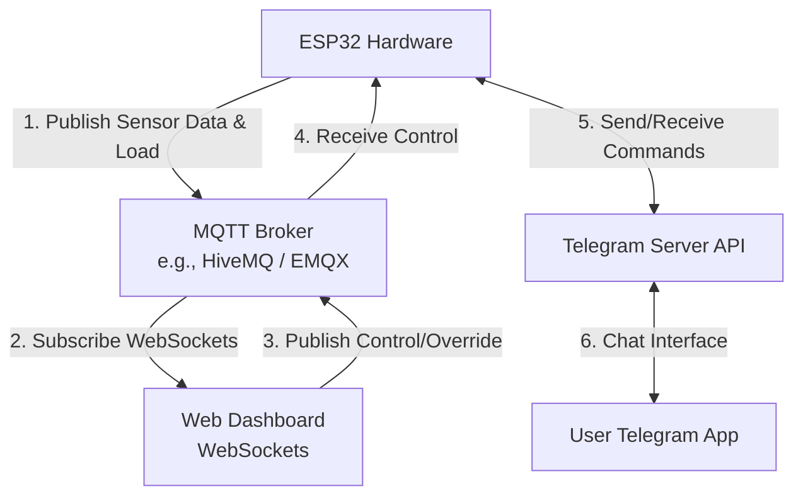

# Panduan Koneksi Real-Time: ESP32, Telegram Bot, dan Web Dashboard

Dokumen ini menjelaskan arsitektur dan langkah-langkah praktis untuk menghubungkan **ESP32 fisik**, **Telegram Bot**, dan **Web Dashboard** Anda secara realtime menggunakan protokol **MQTT** dan **Telegram Bot API**.

---

## 1. Arsitektur Sistem Real-Time

Untuk komunikasi realtime dua arah, kita menggunakan perantara broker MQTT untuk Web Dashboard, dan Telegram API Server untuk Bot Telegram.



---

## 2. Bagian A: Koneksi ESP32 ke Telegram Bot

ESP32 dapat langsung mengirimkan pesan ke Telegram menggunakan **HTTPS request** ke Telegram Bot API.

### Langkah 1: Buat Bot Telegram
1. Buka aplikasi Telegram, cari **@BotFather**.
2. Kirim perintah `/newbot` dan ikuti petunjuknya untuk mendapatkan **Bot Token** (Contoh: `123456789:ABCdefGhIJKlmNoPQRsTUVwxyZ`).
3. Cari **@IDBot** atau **@userinfobot** di Telegram untuk mendapatkan **Chat ID** Anda (berupa deretan angka unik).

### Langkah 2: Instalasi Library di Arduino IDE
Instal library berikut melalui Library Manager:
* **UniversalTelegramBot** (oleh Brian Lough)
* **ArduinoJson** (oleh Benoit Blanchon)

### Langkah 3: Contoh Kode ESP32 untuk Telegram
```cpp
#include <WiFi.h>
#include <WiFiClientSecure.h>
#include <UniversalTelegramBot.h>
#include <ArduinoJson.h>

// Konfigurasi WiFi
const char* ssid = "NAMA_WIFI_ANDA";
const char* password = "PASSWORD_WIFI_ANDA";

// Konfigurasi Telegram
#define BOTtoken "BOT_TOKEN_ANDA"
#define CHAT_ID "CHAT_ID_ANDA"

WiFiClientSecure client;
UniversalTelegramBot bot(BOTtoken, client);

void setup() {
  Serial.begin(115200);
  
  // Hubungkan WiFi
  WiFi.begin(ssid, password);
  client.setCACert(TELEGRAM_CERTIFICATE_ROOT); // Sertifikat SSL Telegram
  
  while (WiFi.status() != WL_CONNECTED) {
    delay(500);
    Serial.print(".");
  }
  Serial.println("\nWiFi Connected!");
  
  // Kirim notifikasi pertama saat ESP32 menyala
  bot.sendMessage(CHAT_ID, "🤖 ESP32 Aktif! Sistem monitoring tangki air dimulai.", "");
}

void loop() {
  // Contoh mengirimkan pesan jika level air <= 20%
  float waterPct = readUltrasonicSensor(); // Fungsi baca sensor Anda
  
  static bool alarmSent = false;
  if (waterPct <= 20 && !alarmSent) {
    bot.sendMessage(CHAT_ID, "⚠️ *PERINGATAN:* Level air kritis (<= 20%). Mengaktifkan mode pengisian air!", "Markdown");
    alarmSent = true;
  } else if (waterPct > 20) {
    alarmSent = false; // Reset status alarm
  }
  
  delay(1000);
}

float readUltrasonicSensor() {
  // Logika pembacaan sensor HC-SR04 Anda
  return 75.0; // dummy return
}
```

---

## 3. Bagian B: Koneksi ESP32 ke Web Dashboard (via MQTT)

Karena dashboard berjalan di browser (front-end client), browser tidak bisa melakukan koneksi TCP socket biasa langsung ke IP ESP32 dengan mudah karena masalah keamanan (CORS) dan IP dinamis. 
Solusi terbaik adalah menggunakan **MQTT over WebSockets**.

### Langkah 1: Gunakan MQTT Broker Gratis
Untuk kebutuhan belajar/tes, Anda bisa menggunakan broker publik gratis seperti:
* **Broker:** `broker.hivemq.com` (Port WebSockets: `8000` atau `8884` SSL)
* **Broker:** `broker.emqx.io` (Port WebSockets: `8083` atau `8084` SSL)

### Langkah 2: Kode ESP32 Kirim Data (Publish) & Terima Kontrol (Subscribe)
Gunakan library **PubSubClient** di Arduino IDE.

```cpp
#include <WiFi.h>
#include <PubSubClient.h>
#include <ArduinoJson.h>

const char* ssid = "NAMA_WIFI_ANDA";
const char* password = "PASSWORD_WIFI_ANDA";
const char* mqtt_server = "broker.hivemq.com";

WiFiClient espClient;
PubSubClient client(espClient);

void setup() {
  Serial.begin(115200);
  WiFi.begin(ssid, password);
  // Tunggu koneksi...
  
  client.setServer(mqtt_server, 1883); // Port standar MQTT non-SSL untuk ESP32
  client.setCallback(callback); // Handler untuk menerima kontrol dari web
}

// Menerima perintah dari Web Dashboard (e.g. Matikan Kipas secara manual)
void callback(char* topic, byte* payload, unsigned int length) {
  String message = "";
  for (int i = 0; i < length; i++) {
    message += (char)payload[i];
  }
  Serial.println("Pesan masuk di topik [" + String(topic) + "]: " + message);
  
  // Contoh parsing kontrol JSON
  StaticJsonDocument<200> doc;
  deserializeJson(doc, message);
  if (doc.containsKey("fan")) {
    bool fanState = doc["fan"];
    digitalWrite(RELAY_FAN_PIN, fanState ? HIGH : LOW);
  }
}

void reconnect() {
  while (!client.connected()) {
    if (client.connect("ESP32_WaterTank_Client")) {
      client.subscribe("smarttank/device/control"); // Subscribe topik kontrol dari dashboard
    } else {
      delay(5000);
    }
  }
}

void loop() {
  if (!client.connected()) {
    reconnect();
  }
  client.loop();

  // Kirim data sensor ke dashboard setiap 5 detik
  static unsigned long lastMsg = 0;
  if (millis() - lastMsg > 5000) {
    lastMsg = millis();
    
    // Siapkan payload JSON
    StaticJsonDocument<200> doc;
    doc["waterLevel"] = 75.0; // Sensor ultrasonic
    doc["pumpState"] = false; // Status pompa
    doc["voltage"] = 18.0;    // Beban listrik
    
    char buffer[256];
    serializeJson(doc, buffer);
    
    client.publish("smarttank/sensor/data", buffer); // Kirim ke dashboard
  }
}
```

### Langkah 3: Hubungkan Web Dashboard JS ke MQTT WebSockets
Di file `index.html` dashboard, Anda dapat menambahkan library **Paho MQTT WS Client** dan menyambungkannya ke Broker MQTT yang sama.

```html
<!-- Masukkan library MQTT di bagian <head> index.html -->
<script src="https://cdnjs.cloudflare.com/ajax/libs/paho-mqtt/1.0.1/mqttws31.min.js" type="text/javascript"></script>

<script>
  // Hubungkan ke MQTT Broker via WebSockets (Port 8000 untuk HiveMQ)
  const client = new Paho.MQTT.Client("broker.hivemq.com", 8000, "clientId_" + Math.random().toString(16).substr(2, 8));

  client.onConnectionLost = onConnectionLost;
  client.onMessageArrived = onMessageArrived;

  client.connect({
    onSuccess: onConnect,
    useSSL: false // gunakan true jika broker mendukung port SSL (misalnya port 8884)
  });

  function onConnect() {
    console.log("Dashboard terhubung ke MQTT Broker!");
    // Subscribe ke topik data sensor dari ESP32
    client.subscribe("smarttank/sensor/data");
  }

  function onConnectionLost(responseObject) {
    if (responseObject.errorCode !== 0) {
      console.log("Koneksi terputus: " + responseObject.errorMessage);
    }
  }

  // Menerima data realtime dari ESP32
  function onMessageArrived(message) {
    console.log("Data diterima: " + message.payloadString);
    try {
      const data = JSON.parse(message.payloadString);
      
      // Update variabel simulasi / state di dashboard dengan data asli ESP32!
      waterLevel = data.waterLevel;
      pumpState = data.pumpState;
      
      // Update visual dashboard secara realtime
      updateDashboardUI();
    } catch(e) {
      console.error("Format data salah", e);
    }
  }

  // Fungsi untuk mengirim kontrol dari Dashboard ke ESP32
  function sendControlToESP32(controlData) {
    const message = new Paho.MQTT.Message(JSON.stringify(controlData));
    message.destinationName = "smarttank/device/control";
    client.send(message);
  }
</script>
```

---

## 4. Kesimpulan Alur Kerja Integrasi
1. **ESP32** membaca sensor ultrasonic & beban listrik.
2. Jika ada status kritis (misal air <= 20%), **ESP32** mengirim pesan notifikasi ke API Telegram **@SmartTank_Bot** yang akan diteruskan ke aplikasi HP Anda.
3. Secara berkala, **ESP32** mengirimkan data JSON (level air, status relay) ke MQTT Broker gratis (`broker.hivemq.com`) melalui koneksi internet WiFi.
4. **Web Dashboard** yang dibuka di browser (laptop/HP) tersambung ke MQTT Broker yang sama menggunakan WebSockets. Dashboard akan langsung terupdate secara realtime tanpa perlu me-refresh halaman!
5. Sebaliknya, tombol manual di **Web Dashboard** dapat mengirim sinyal balik melalui broker MQTT untuk mematikan/menyalakan perangkat fisik di **ESP32**.
